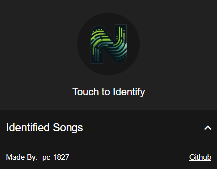
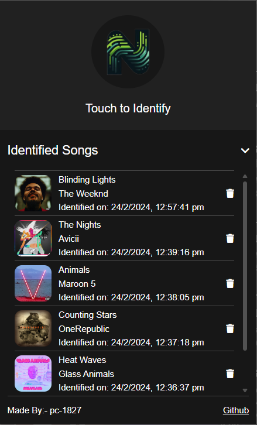

# Nirvana - Music Identifier

[Nirvana](https://microsoftedge.microsoft.com/addons/detail/nirvana-music-identifer/ijmpdnfcdbejgbmdoooebfkafplebake) is a music identifier extension designed to help users quickly identify songs playing around them. With [Nirvana](https://microsoftedge.microsoft.com/addons/detail/nirvana-music-identifer/ijmpdnfcdbejgbmdoooebfkafplebake), users can easily recognize songs playing on various platforms and access detailed information about the identified tracks.

## Overview

Have you ever found yourself in a situation where you hear a catchy tune but can't quite place the song? [Nirvana](https://microsoftedge.microsoft.com/addons/detail/nirvana-music-identifer/ijmpdnfcdbejgbmdoooebfkafplebake) is here to rescue you! Simply activate the extension, let it listen to the music, and get instant details about the track, including its title, artist, album, and more.

## Availability

[Nirvana - Music Identifier](https://microsoftedge.microsoft.com/addons/detail/nirvana-music-identifer/ijmpdnfcdbejgbmdoooebfkafplebake) is available on Microsoft Edge Addons. You can easily install it from the Microsoft Edge Addons store and start using it right away.

### How to Use the Extension

To identify music, simply play the music or video you want to recognize. Then, click on the Nirvana logo located at the center. The extension will automatically record a few seconds of audio from your browser, encode it, and send it to the API for identification.

Once the song is identified, it will be displayed under the "Identified Songs" section within the extension. To access more information about the song, simply click on it.

Clicking on a recognized song will open a new tab to the official music video on Youtube.

Stay tuned for updates and new features! If you enjoy using the extension, please consider leaving a review on [Microsoft Edge Addons](https://microsoftedge.microsoft.com/addons/detail/nirvana-music-identifer/ijmpdnfcdbejgbmdoooebfkafplebake) and starring the GitHub repository. Your feedback and support are greatly appreciated.
